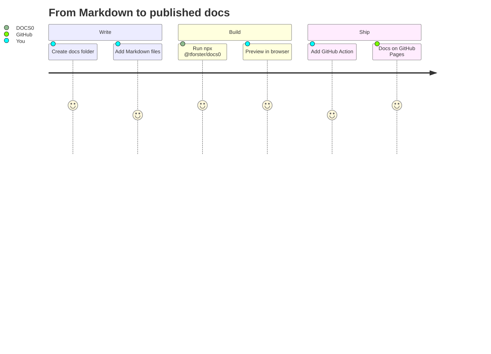

# Getting Started <!-- omit in toc -->

Welcome! This section takes you from zero to a published documentation site in about five minutes.

## Table of Contents <!-- omit in toc -->

- [Prerequisites](#prerequisites)
- [The path](#the-path)

## Prerequisites

- [Node.js](https://nodejs.org) **20 or newer**
- A folder containing at least one `.md` file

## The path

1. [Installation](01-installation.md) — optional; `npx` works without installing anything
2. [Quick Start](02-quick-start.md) — build and view your first site
