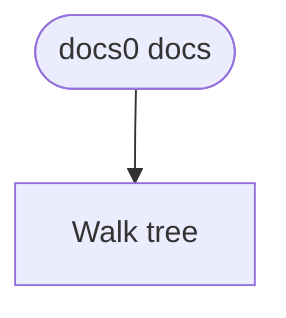
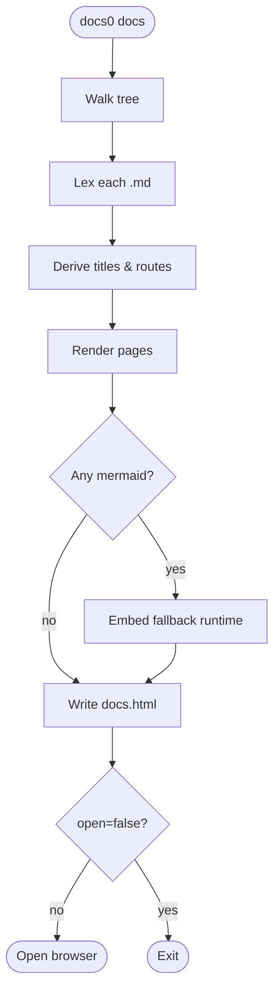
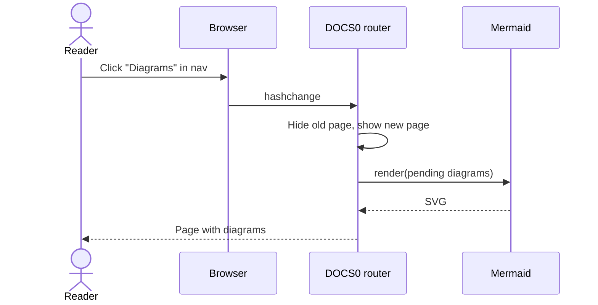
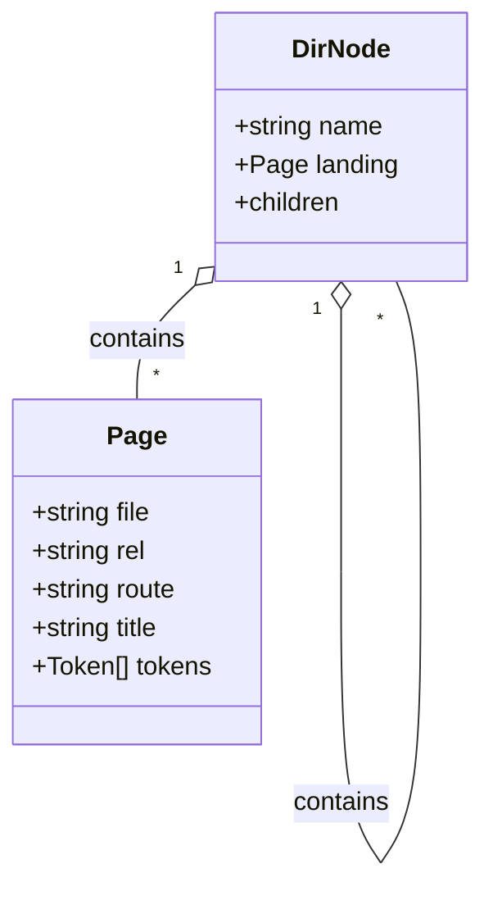
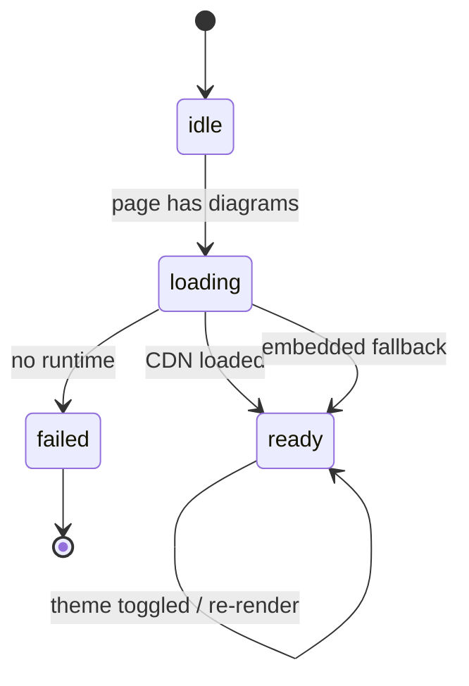
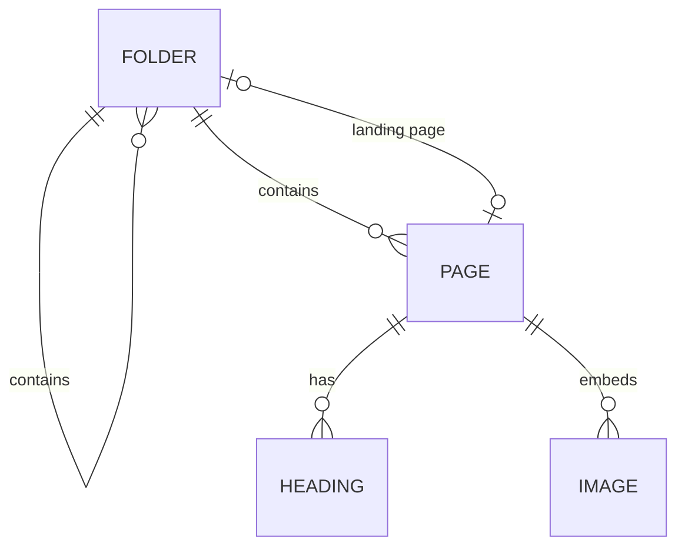
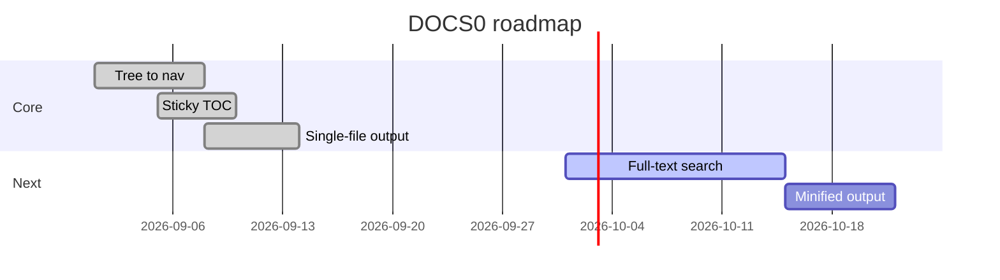
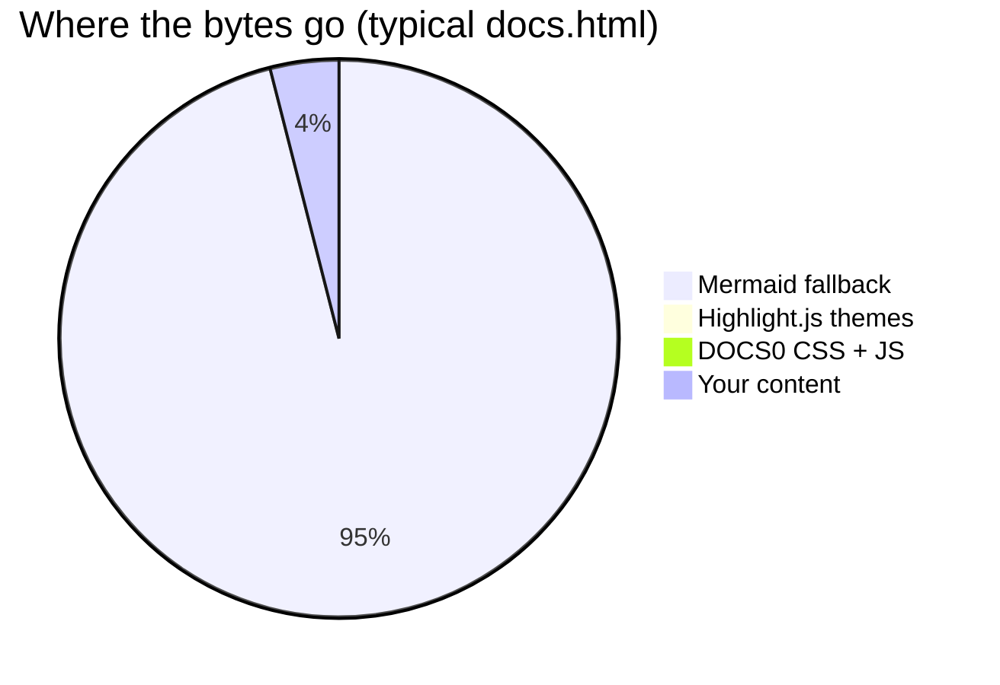
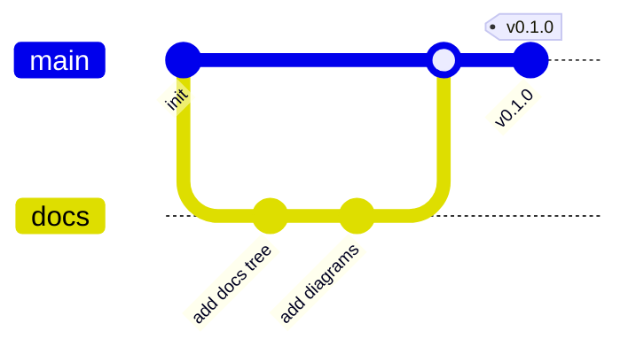

# Diagrams <!-- omit in toc -->

Fenced code blocks tagged `mermaid` are rendered as diagrams. They follow the light/dark theme and re-render when you toggle it.

## Table of Contents <!-- omit in toc -->

- [Flowchart](#flowchart)
- [Sequence diagram](#sequence-diagram)
- [Class diagram](#class-diagram)
- [State diagram](#state-diagram)
- [Entity relationship](#entity-relationship)
- [Gantt chart](#gantt-chart)
- [Pie chart](#pie-chart)
- [Git graph](#git-graph)
- [How loading works](#how-loading-works)

## Flowchart

````markdown

````



## Sequence diagram



## Class diagram



## State diagram



## Entity relationship



## Gantt chart



## Pie chart



## Git graph



## How loading works

> [!NOTE]
> Mermaid is loaded from the jsDelivr CDN the first time a page with diagrams is opened. If the CDN is unreachable, DOCS0 uses
> a copy embedded in `docs.html` — so diagrams render offline too. Pages without diagrams never load Mermaid at all, and builds
> without any diagrams leave the embedded copy out entirely.
