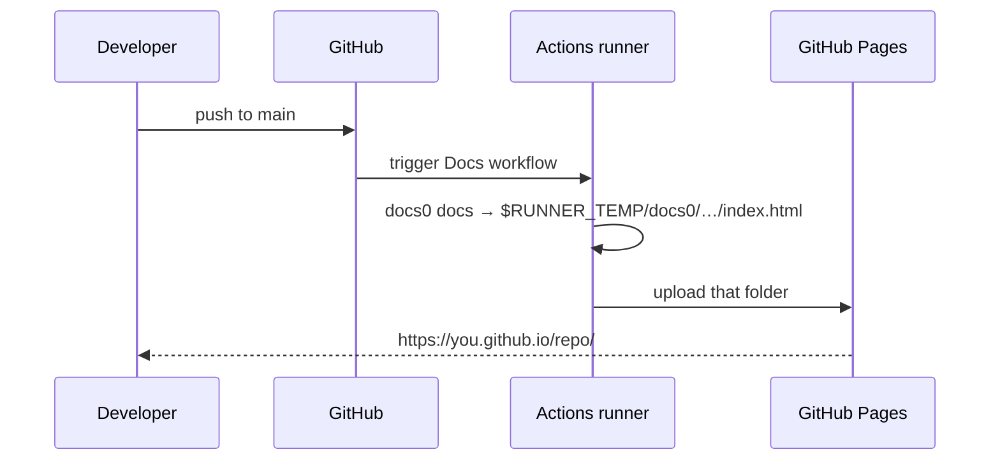

# Publishing to GitHub Pages <!-- omit in toc -->

Because the output is a single file, publishing is just "build, then upload one file".

## Table of Contents <!-- omit in toc -->

- [The workflow](#the-workflow)
- [Enable Pages](#enable-pages)
- [Custom output locations](#custom-output-locations)

## The workflow

Save as `.github/workflows/docs.yml`:

```yaml
name: Docs

on:
  push:
    branches: [main]
  workflow_dispatch:

permissions:
  contents: read
  pages: write
  id-token: write

concurrency:
  group: pages
  cancel-in-progress: true

jobs:
  deploy:
    runs-on: ubuntu-latest
    environment:
      name: github-pages
      url: ${{ steps.deployment.outputs.page_url }}
    steps:
      - uses: actions/checkout@v4
        with:
          fetch-depth: 0
      - uses: actions/setup-node@v4
        with:
          node-version: 22
      - id: docs
        run: npx --yes @tforster/docs0 docs
      - uses: actions/upload-pages-artifact@v3
        with:
          path: ${{ steps.docs.outputs.dir }}
      - id: deployment
        uses: actions/deploy-pages@v4
```



> [!TIP]
> `fetch-depth: 0` fetches full history so each page's **last updated** date comes from its latest commit. With the default
> shallow clone every page would show the date of the most recent commit.

## Enable Pages

1. Open **Settings → Pages** in your repository.
2. Under **Build and deployment → Source**, choose **GitHub Actions**.
3. Push to `main`.

> [!WARNING]
> Pages must be set to deploy from **GitHub Actions**, not from a branch, for `actions/deploy-pages` to work.

## Custom output locations

| Goal              | Command                                                   |
| :---------------- | :-------------------------------------------------------- |
| Local preview     | `docs0 docs`                                              |
| Pages site root   | `docs0 docs`, then upload `steps.<id>.outputs.dir`        |
| Versioned archive | `docs0 docs --out=releases/docs-v1.2.0.html --open=false` |
