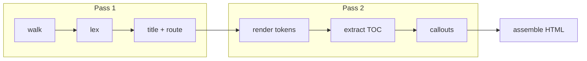

# Architecture <!-- omit in toc -->

## Table of Contents <!-- omit in toc -->

- [Design goals](#design-goals)
- [Build pipeline](#build-pipeline)
- [Output anatomy](#output-anatomy)
- [Version detection](#version-detection)
- [Last updated dates](#last-updated-dates)

## Design goals

1. **One file out.** The output must work from `file://`, an email attachment or any static host.
2. **Two dependencies.** marked and highlight.js; nothing else at runtime.
3. **No config.** Conventions over settings — see [Writing Docs](../02-guides/01-writing-docs.md).

## Build pipeline

The build is two passes so that pages can link to each other by route before any of them is rendered.



```javascript
// Pass 2, per page (simplified)
Object.assign(ctx, { file: p.file, route: p.route, slugs: new Map() });
const tocTokens = extractToc(p.tokens); // removes "## Table of Contents" + list
const body = applyCallouts(marked.parser(p.tokens));
const toc = tocTokens ? marked.parser(tocTokens) : "";
```

## Output anatomy

```html
<header id="topbar">…brand · path · version · theme…</header>
<nav id="nav">…folder tree…</nav>
<main id="content">
  <article class="page has-toc" data-route="guides/diagrams" hidden>
    <div class="page-main">…rendered markdown…</div>
    <aside class="page-toc">…sticky TOC…</aside>
  </article>
  …one article per page…
</main>
<script type="text/plain" id="docs0-mermaid">
  …offline fallback…
</script>
<script>
  …router, spy, theme…
</script>
```

## Version detection

The version badge in the top bar comes from the nearest `package.json` with a `version` field, searching the docs root first
and then each parent folder. If none is found the badge is omitted.

## Last updated dates

The date beside the path in the top bar is the file's latest commit date, read from `git log` in a single pass (so it works in
[jj](https://jj-vcs.github.io/jj/) colocated repos too). Files with uncommitted changes, untracked files, and builds outside a
git checkout use the file's modified time instead. Dates are shown as `yyyy-mm-dd`.
