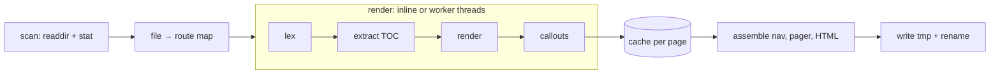

# Architecture <!-- omit in toc -->

## Table of Contents <!-- omit in toc -->

- [Design goals](#design-goals)
- [Build pipeline](#build-pipeline)
- [Output anatomy](#output-anatomy)
- [Version detection](#version-detection)
- [Last updated dates](#last-updated-dates)

## Design goals

1. **One file out.** The output must work from `file://`, an email attachment or any static host.
2. **Two dependencies.** marked and highlight.js; nothing else at runtime.
3. **No config.** Conventions over settings — see [Writing Docs](../02-guides/01-writing-docs.md).

## Build pipeline

A page's body never depends on another page's content or title, only on the site's file → route map, which comes from paths
alone. So every page renders as an independent job, and only the cheap, site-wide parts (nav, pager, folder labels) are
assembled on the main thread.



| Module                 | Runs on        | Job                                                    |
| :--------------------- | :------------- | :----------------------------------------------------- |
| `dist/docs0.js`        | main thread    | CLI, scan, worker pool, cache, assembly, watch         |
| `dist/docs0.render.js` | main or worker | One page: Markdown → HTML, TOC, warnings, dependencies |
| `dist/docs0.worker.js` | worker thread  | Receives routes and pages, returns render results      |
| `dist/docs0.shared.js` | both           | Dependency-free helpers (escaping, slugs, routes)      |

Trees below 40 pages render inline, because starting workers would cost more than it saves. Larger trees use one
[`worker_threads`](https://nodejs.org/api/worker_threads.html) worker per spare core (up to 8). Each worker takes the next
queued page as soon as it is free, so a few slow pages don't hold up the rest.

```javascript
// Per page, in docs0.render.js (simplified)
const tokens = marked.lexer(readFileSync(file, "utf8"));
const tocTokens = extractToc(tokens); // removes "## Table of Contents" + list
const body = applyCallouts(marked.parser(tokens));
return { title, body, toc, mermaid, warnings, images, links };
```

Each result records the local images it inlined and the link targets it resolved. In `--watch` mode, those let a rebuild re-render
only the pages a change affects. See [Watch mode](01-cli.md#watch-mode).

## Output anatomy

```html
<header id="topbar">…brand · path · version · theme…</header>
<nav id="nav">…folder tree…</nav>
<main id="content">
  <article class="page has-toc" data-route="guides/diagrams" hidden>
    <div class="page-main">…rendered markdown…</div>
    <aside class="page-toc">…sticky TOC…</aside>
  </article>
  …one article per page…
</main>
<script type="text/plain" id="docs0-mermaid">
  …offline fallback…
</script>
<script>
  …router, spy, theme…
</script>
```

## Version detection

The version badge in the top bar comes from the nearest `package.json` with a `version` field, searching the docs root first
and then each parent folder. If none is found the badge is omitted.

## Last updated dates

The date beside the path in the top bar is the file's modified time, shown as `yyyy-mm-dd`. It comes from the same `stat` the
scan already makes, so it costs nothing and needs no version control. A fresh CI checkout sets every file's modified time to the
checkout time. See [Publishing](../02-guides/04-publishing.md) for restoring real dates first.
