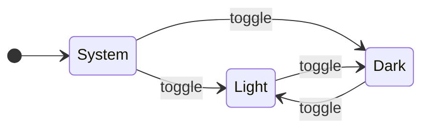

# Theming <!-- omit in toc -->

## Table of Contents <!-- omit in toc -->

- [Light and dark](#light-and-dark)
- [Design tokens](#design-tokens)
- [Reading layout](#reading-layout)

## Light and dark

The initial theme follows your operating system (`prefers-color-scheme`). The ☀/☾ button in the top bar overrides it, and the
choice is remembered in `localStorage`. Until you choose, DOCS0 follows live system changes.



## Design tokens

All colours are CSS custom properties on `:root`, swapped under `:root[data-theme="dark"]`:

```css
:root {
  --bg: #ffffff;
  --text: #1f2328;
  --accent: #0969da;
}
:root[data-theme="dark"] {
  --bg: #0d1117;
  --text: #e6edf3;
  --accent: #58a6ff;
}
```

Syntax colours use highlight.js's **GitHub** and **GitHub Dark** themes, scoped to the same attribute.

## Reading layout

Two top-bar buttons trade the sidebars for reading width. Both choices are stored in `localStorage` and applied before first
paint, so a reload doesn't flash the old layout.

| Control         | Hides                  | Content width              | Stored as                 |
| :-------------- | :--------------------- | :------------------------- | :------------------------ |
| ☰ (nav toggle) | Left nav               | Grows into the nav's space | `docs0-nav` = `collapsed` |
| Zen             | Left nav and right TOC | Full window width          | `docs0-zen` = `1`         |

Diagrams scale down to fit their column, never beyond their natural size, so wide sequence diagrams and Gantt charts gain the
most from the extra room. On narrow screens (800px and below) the nav is always off-canvas, and ☰ opens it over the page.
