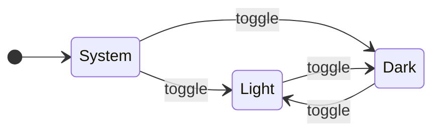

# Theming <!-- omit in toc -->

## Table of Contents <!-- omit in toc -->

- [Light and dark](#light-and-dark)
- [Design tokens](#design-tokens)

## Light and dark

The initial theme follows your operating system (`prefers-color-scheme`). The ☀/☾ button in the top bar overrides it, and the
choice is remembered in `localStorage`. Until you choose, DOCS0 follows live system changes.



## Design tokens

All colours are CSS custom properties on `:root`, swapped under `:root[data-theme="dark"]`:

```css
:root {
  --bg: #ffffff;
  --text: #1f2328;
  --accent: #0969da;
}
:root[data-theme="dark"] {
  --bg: #0d1117;
  --text: #e6edf3;
  --accent: #58a6ff;
}
```

Syntax colours use highlight.js's **GitHub** and **GitHub Dark** themes, scoped to the same attribute.
