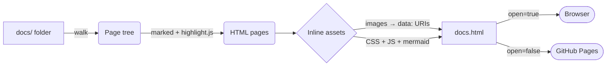

# DOCS0 Documentation <!-- omit in toc -->

DOCS0 turns a folder of Markdown files into **one self-contained HTML file** — navigation, styles, scripts, images and diagrams
included. Email it, attach it to a ticket, or publish it to GitHub Pages. No server, no build chain, no config.

## Table of Contents <!-- omit in toc -->

- [1. Why DOCS0](#1-why-docs0)
- [2. How it works](#2-how-it-works)
- [3. Where to next](#3-where-to-next)

## 1. Why DOCS0

Most documentation tools want a framework, a config file and a dev server. DOCS0 wants a folder.

| You want                         | DOCS0 gives you                                     |
| :------------------------------- | :-------------------------------------------------- |
| Navigate a tree of docs          | A left nav that mirrors your folder hierarchy       |
| Navigate within a long page      | A sticky "On this page" sidebar built from your TOC |
| See diagrams, not diagram source | Rendered [Mermaid](https://mermaid.js.org) diagrams |
| Read code comfortably            | Syntax highlighting for 190+ languages              |
| Share it                         | One HTML file with everything embedded              |

> [!TIP]
> This very site is DOCS0 dogfooding its own `docs/` folder. Run `npm start` in the repo to rebuild it.

## 2. How it works

Every page is rendered at build time. In the browser a tiny hash router shows one page at a time, so links like
[Quick Start](01-getting-started/02-quick-start.md) work without a server.

## 3. Where to next

- New here? Start with [Getting Started](01-getting-started/README.md).
- Writing docs? Read [Writing Docs](02-guides/01-writing-docs.md) and browse the [Markdown Showcase](02-guides/02-markdown-showcase.md).
- Need the flags? See the [CLI Reference](03-reference/01-cli.md).
